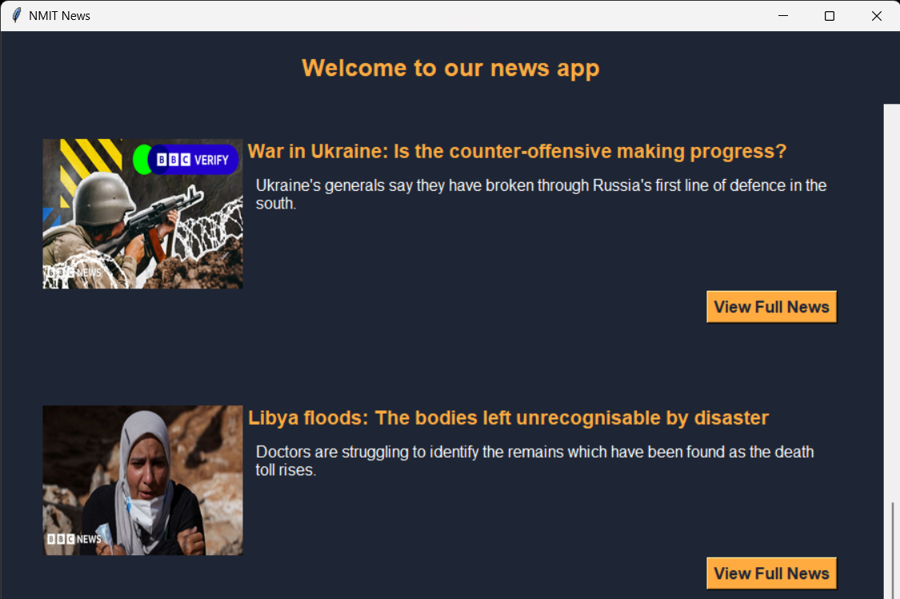

# 📰 News Application

## Overview

This News application is a Python-based desktop application that fetches and displays the latest news articles from BBC News using the NewsAPI. The application provides an intuitive user interface to browse trending news articles along with their images and descriptions. Users can click on links to view the full articles in their web browser.

## Features

- **Responsive Design**: The application is designed to fit various screen sizes while maintaining usability. 📱💻
- **Dark Mode**: A sleek dark theme enhances the reading experience, especially in low-light environments. 🌙
- **Trending News**: Displays the top headlines from BBC News, updated in real-time. 🔥
- **Image Display**: Shows relevant images for each news article to enhance the visual experience. 🖼️
- **Article Descriptions**: Provides short descriptions for each article to give users a preview before they read the full content. 📖
- **Open News in Browser**: Users can easily access full articles in their default web browsers. 🌐

## Prerequisites

- Python 3.x
- Required Python libraries:
  - `requests`
  - `Pillow`
  - `tkinter` (comes pre-installed with Python)

## Setup Instructions

1. **Clone the Repository**:
   Clone this repository to your local machine using the following command:
   ```bash
   git clone https://github.com/kishorgs/AutoNews.git
   cd AutoNews
   ```

2. **Install Required Libraries**:
   Make sure you have `requests` and `Pillow` installed. You can install these using pip:
   ```bash
   pip install requests Pillow
   ```

3. **Obtain a News API Key**:
   - Sign up for an API key at [NewsAPI](https://newsapi.org).
   - Replace the API key in the `get_top_trending_news` method of the `NewsApp` class in the code:
     ```python
     main_url = "https://newsapi.org/v2/top-headlines?sources=bbc-news&apiKey=YOUR_API_KEY&pageSize=50"
     ```

4. **Run the Application**:
   You can run the application by executing the following command in your terminal:
   ```bash
   python news_auto.py
   ```

## How to Use

- Upon launching the application, you will see a welcome message and a list of trending news articles from BBC News.
- Each article displays its title, image, and description.
- Click on the "View Full News" button to open the article in your web browser.

## Screenshots

Here are some screenshots of the application:

  

  
